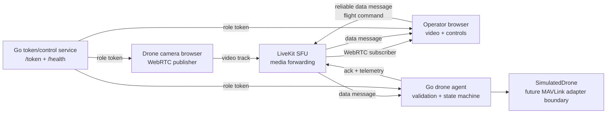

# DroneLink: A low-latency RemoteOps simulator

By Raymond Gan

DroneLink is a local [LiveKit](https://github.com/livekit/livekit)-based simulator
for remote drone operations. It combines a browser WebRTC media plane with a Golang
control plane to explore low latency, network quality, authorization, command
ordering, telemetry, and safe behavior when connectivity or operator input
disappears.

## Features

- Simulated drone camera publishes webcam video; an operator subscribes through LiveKit's SFU.
- Keyboard + button flight controls use LiveKit data messages.
- Click buttons, in this order, to start flying the simulated drone:
  - `Arm → Take Off`
- Fly drone with these keys. Animated **Flight Visualization** boxes to right of webcam video move 2 images of a drone in 6 directions as you fly the drone:
  - **W**: forward
  - **S**: backward
  - **A**: left
  - **D**: right
  - **R**: up
  - **F**: down
- Click `Land` or `Return Home` buttons to land the drone. `Return Home` will first move drone image to center of **Flight Visualization** box, then lower it to 0 altitude.
- Go drone agent validates commands and returns acknowledgements and telemetry every 1 second.
- **Drone Telemetry** in UI shows simulated:
  - flight state
  - battery life
  - altitude (m)
  - velocity
  - failsafe status
  - last accepted command (date/time)
  - updated (date/time)

- **WebRTC Link Health** in UI shows real-time video stats for:
  - connection state (`connecting`, `connected`, `disconnected`, or `failed`)
  - candidate path (`host`, `srflx`, or `relay`)
  - RTT (Round-Trip Time) in ms
  - packet loss (%)
  - jitter (ms)
  - inbound video bitrate (kbps).
- Test its **dead-man failsafe** feature:
  - What if operator suddenly loses contact with drone while flying?
  - While still flying drone (holding down 1 of the 6 velocity keys), suddenly click "Leave" or disconnect your WiFi
  - If drone gets no new velocity commands in 500 ms, it won't keep flying in same direction. Instead, it:
    - Sets drone velocity to 0
    - Changes drone state to `HOVER_FAILSAFE`. Now drone hovers mid-air, waiting for your next command.
    - Publishes telemetry saying why it changed.
    - When you reload http://localhost:8080/operator.html and rejoin as operator, it shows a red failsafe banner on top.
    - If you start flying the drone again, it changes back to `FLYING` state and the red banner disappears.

## Architecture



LiveKit supplies signaling and SFU functionality. The SFU forwards the encoded
camera track without application-level decoding and re-encoding; the control
plane remains separate from the media plane.

## WebRTC and SFU concepts

The project is built around the WebRTC stack relevant to live teleoperation:

- **SDP and signaling** negotiate tracks, capabilities, and connection metadata.
- **ICE** selects a viable network path using host, STUN-derived server-reflexive,
  or TURN relay candidates.
- **STUN/TURN** handle NAT discovery and restrictive firewalls.
- **DTLS/SRTP** secure the transport and media packets.
- **RTP/RTCP** carry encoded media and quality feedback such as RTT and loss data.
- **SFU semantics** let one camera upload once while LiveKit selectively forwards
  it to subscribers, avoiding peer-to-peer fan-out.

The browser enables `adaptiveStream` and `dynacast`, and the operator turns
receiver statistics into operational signals. This reflects an important
RemoteOps distinction: late video can be discarded, but flight commands need
validation, ordering, acknowledgement, and a safe failure policy.

## Go control plane and safety model

The Go services use LiveKit's Go SDK and provide:

- `/health` and role-scoped `/token` endpoints with short-lived JWTs.
- Capabilities for `operator`, `drone-camera`, and `drone-agent` identities.
- Structured logs for joins, commands, acknowledgements, and telemetry.
- A mutex-protected simulated drone state machine.
- Command IDs for idempotency: duplicates acknowledge without reapplying.
- Timestamp validation and monotonic ordering for velocity commands.
- Sender authorization requiring an operator identity.
- A 500 ms dead-man velocity failsafe and immediate stop on disconnect.
- Explicit `DISARMED`, `ARMED`, `FLYING`, `LANDING`, and `HOVER_FAILSAFE` states for the drone. Its state machine may only change in this order: `DISARMED → ARMED → FLYING → LANDING → DISARMED`.

These mechanisms demonstrate Go concurrency and shared-state protection in a
real-time system where responsiveness must not weaken command safety.

## Engineering features added in this order

My Git branch history shows RemoteOps evolving from a health/token
service:

1. Added LiveKit tokens and browser camera/operator flows.
2. Added the Go agent, telemetry, acknowledgements, and state validation.
3. Added safe delivery, timestamp windows, monotonic velocity ordering, and
   idempotent command IDs.
4. Added sender checks, disconnect stop behavior, and the dead-man failsafe.
5. Added WebRTC link-health diagnostics based on receiver statistics.
6. Added visual state transitions, drone movement simulation, and reliable
   return-home landing.

## Running locally

1. Clone my code to your laptop:
```
git clone git@github.com:rayning0/dronelink.git
cd dronelink
```

2. [Install LiveKit](https://docs.livekit.io/transport/self-hosting/local/):
```
brew update && brew install livekit
```
2. Create `.env` file. Use LiveKit's default API key and secret:
```
LIVEKIT_URL=ws://127.0.0.1:7880
LIVEKIT_API_KEY=devkey
LIVEKIT_API_SECRET=secret
```
3. Open 3 tabs in Mac Terminal:
- In tab 1, do `livekit-server --dev` to start LiveKit in dev mode.
- In tab 2, do `go run .` to start control plane code.
- In tab 3, do `go run ./drone-agent` to start simulated drone agent.

4. Open 2 pages in your browser:

http://localhost:8080/drone.html shows the simulated drone camera. Click "Join as drone camera." It turns on your webcam and starts sending video to the LiveKit SFU server.

http://localhost:8080/operator.html shows the simulated drone operator. Click "Join as operator." It shows real-time video sent by the LiveKit SFU.

5. Fly drone:

- Click buttons in this order to start flying the simulated drone:
  - `Arm → Take Off`
- Fly drone with these keys. Animated **Flight Visualization** boxes to right of webcam video move 2 images of a drone in 6 directions as you fly the drone:
  - **W**: forward
  - **S**: backward
  - **A**: left
  - **D**: right
  - **R**: up
  - **F**: down
- Click `Land` or `Return Home` buttons to land the drone. `Return Home` will first move drone image to center of **Flight Visualization** box, then lower it to 0 altitude.

6. Test its **dead-man failsafe** feature:

- What if operator suddenly loses contact with drone while flying?
- While still flying drone (holding down 1 of the 6 velocity keys, like "W"), suddenly click "Leave" or disconnect your WiFi
- If drone gets no new velocity commands in 500 ms, it won't keep flying in same direction. Instead, it:
  - Sets drone velocity to 0
  - Changes drone state to `HOVER_FAILSAFE`. Now drone hovers mid-air, waiting for your next command.
  - Publishes telemetry saying why it changed.
  - When you reload http://localhost:8080/operator.html and rejoin as operator, it shows a red failsafe banner on top.
  - If you start flying the drone again, it changes back to `FLYING` state and the red banner disappears.

## Production roadmap

This is a simulator, not a flight-certified system. To change it for production, I'd:

1. Implement the adapter boundary against a flight controller or companion
   computer, likely via MAVLink, and report hardware-confirmed state.
2. Add an identity provider, fleet/room authorization, secret rotation, audit
   trails, and stronger device authentication.
3. Define Protobuf schemas and durable command/telemetry semantics that survive
   reconnects and agent restarts, including explicit replay protection.
4. Deploy regional LiveKit/SFU capacity and redundant STUN/TURN with UDP and
   TCP/TLS fallback; test bandwidth policies and H.264/VP8/VP9 compatibility.
5. Export metrics, traces, and WebRTC quality data (loss, jitter, RTT, bitrate,
   reconnects, keyframes, and TURN usage) with alerts and on-call runbooks.
6. Add unit, race, integration, browser, fuzz, and network-impairment tests for
   delayed, duplicated, reordered, and disconnected messages.
7. Containerize and deploy with Kubernetes, rolling upgrades, capacity limits,
   readiness probes, and failure-injection exercises.
8. Add geofencing, preflight checks, battery/link-loss policies, emergency-stop
   semantics, operator confirmations, and formal safety review.
9. Secure recordings and telemetry with retention, deletion, privacy, and
   regional data-handling policies.

For production, I'd keep the media plane low-latency and observable
while making the control plane authenticated, replay-resistant, auditable, and
fail-safe.
