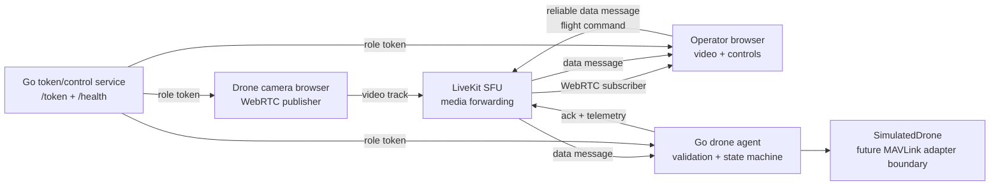

# DroneLink: A low-latency RemoteOps simulator

By Raymond Gan

DroneLink is a local [LiveKit](https://github.com/livekit/livekit)-based simulator
for remote drone operations. It combines a browser WebRTC media plane with a Go
control plane to explore low latency, network quality, authorization, command
ordering, telemetry, and safe behavior when connectivity or operator input
disappears.

## Features

- Simulated drone camera publishes webcam video; an operator subscribes through
  LiveKit's SFU.
- Keyboard and button flight controls use LiveKit data messages.
- Go drone agent validates commands and returns acknowledgements and telemetry.
- UI displays flight state, battery, altitude, velocity, command results, and
  failsafe status.
- Return-home-and-land demonstrates a multi-step safety workflow.
- WebRTC link diagnostics show connection state, candidate path (`host`, `srflx`,
  or `relay`), RTT, and inbound video bitrate.

## Architecture



LiveKit supplies signaling and SFU functionality. The SFU forwards the encoded
camera track without application-level decoding and re-encoding; the control
plane remains separate from the media plane.

## WebRTC and SFU concepts

The project is built around the WebRTC stack relevant to live teleoperation:

- **SDP and signaling** negotiate tracks, capabilities, and connection metadata.
- **ICE** selects a viable network path using host, STUN-derived server-reflexive,
  or TURN relay candidates.
- **STUN/TURN** handle NAT discovery and restrictive firewalls.
- **DTLS/SRTP** secure the transport and media packets.
- **RTP/RTCP** carry encoded media and quality feedback such as RTT and loss data.
- **SFU semantics** let one camera upload once while LiveKit selectively forwards
  it to subscribers, avoiding peer-to-peer fan-out.

The browser enables `adaptiveStream` and `dynacast`, and the operator turns
receiver statistics into operational signals. This reflects an important
RemoteOps distinction: late video can be discarded, but flight commands need
validation, ordering, acknowledgement, and a safe failure policy.

## Go control plane and safety model

The Go services use LiveKit's Go SDK and provide:

- `/health` and role-scoped `/token` endpoints with short-lived JWTs.
- Capabilities for `operator`, `drone-camera`, and `drone-agent` identities.
- Structured logs for joins, commands, acknowledgements, and telemetry.
- A mutex-protected simulated drone state machine.
- Command IDs for idempotency: duplicates acknowledge without reapplying.
- Timestamp validation and monotonic ordering for velocity commands.
- Sender authorization requiring an operator identity.
- A 500 ms dead-man velocity failsafe and immediate stop on disconnect.
- Explicit `DISARMED`, `ARMED`, `FLYING`, `LANDING`, and `HOVER_FAILSAFE` states.

These mechanisms demonstrate Go concurrency and shared-state protection in a
real-time system where responsiveness must not weaken command safety.

## Engineering progression

The branch history shows a complete RemoteOps slice evolving from a health/token
service:

1. Added LiveKit tokens and browser camera/operator flows.
2. Added the Go agent, telemetry, acknowledgements, and state validation.
3. Added safe delivery, timestamp windows, monotonic velocity ordering, and
   idempotent command IDs.
4. Added sender checks, disconnect stop behavior, and the dead-man failsafe.
5. Added WebRTC link-health diagnostics based on receiver statistics.
6. Added visual state transitions, drone movement simulation, and reliable
   return-home landing.

## Running locally

```sh
export LIVEKIT_API_KEY=...
export LIVEKIT_API_SECRET=...
go run .
go run ./drone-agent
```

Open `http://127.0.0.1:8080`, start the camera page, and join from the operator
page. Credentials are supplied through the environment rather than committed.

## Production-readiness roadmap

This is a simulator, not a flight-certified system. To productionize it, I would:

1. Implement the adapter boundary against a flight controller or companion
   computer, likely via MAVLink, and report hardware-confirmed state.
2. Add an identity provider, fleet/room authorization, secret rotation, audit
   trails, and stronger device authentication.
3. Define Protobuf schemas and durable command/telemetry semantics that survive
   reconnects and agent restarts, including explicit replay protection.
4. Deploy regional LiveKit/SFU capacity and redundant STUN/TURN with UDP and
   TCP/TLS fallback; test bandwidth policies and H.264/VP8/VP9 compatibility.
5. Export metrics, traces, and WebRTC quality data (loss, jitter, RTT, bitrate,
   reconnects, keyframes, and TURN usage) with alerts and on-call runbooks.
6. Add unit, race, integration, browser, fuzz, and network-impairment tests for
   delayed, duplicated, reordered, and disconnected messages.
7. Containerize and deploy with Kubernetes, rolling upgrades, capacity limits,
   readiness probes, and failure-injection exercises.
8. Add geofencing, preflight checks, battery/link-loss policies, emergency-stop
   semantics, operator confirmations, and formal safety review.
9. Secure recordings and telemetry with retention, deletion, privacy, and
   regional data-handling policies.

The production principle is to keep the media plane low-latency and observable
while making the control plane authenticated, replay-resistant, auditable, and
fail-safe.
